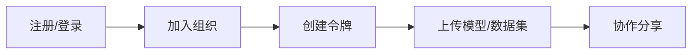

## Quick start

Help you quickly get started with the core functions of Moha Repository.

## Preparation

Before using Moha Repository, please confirm:

1. **Have a platform account** — Contact the administrator to create an account or register yourself
2. **Join the organization** — Models and datasets belong to the organization, and you need to join or create the organization first
3. **Create Access Token** — used for authentication for Git operations and API calls

## Quick start process

## Related documents

| Documentation | Description |
|------|------|
| [Beginner's Guide](./01.guide) | Complete operation process from scratch |
| [Account Settings](./02.account) | Configure personal information and preferences |
| [Access Token](./03.token) | Create and manage authentication tokens |