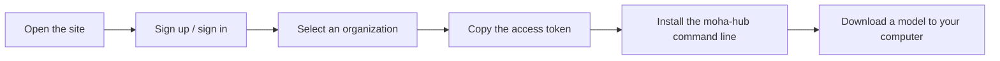

# Quick Start

This section is the **first lesson** for Moha. Work through the three pages below in order and you will be able to: open the site, sign up or sign in, select your organization, get an access token, and pull your first model down to your computer from the command line.

The whole thing takes about 15 minutes. You only need a browser and a terminal — no prior knowledge of any technical term.

:::tip Three words to remember first

- **Organization**: a team space whose members share repositories.
- **Repository**: a folder holding a model or dataset, named like `ai-lab/qwen2-7b`.
- **Access token**: a pass that replaces your password, so the command line can prove who you are.

:::

## The whole path

```mermaid
flowchart LR
    A["Open the site"] --> B["Sign up / sign in"]
    B --> C["Select an organization"]
    C --> D["Copy the access token"]
    D --> E["Install the moha-hub command line"]
    E --> F["Download a model to your computer"]
```

## Three pages and you are running

| Order | Page | After reading you will |
| --- | --- | --- |
| 1 | [Quick Start](/moha/quickstart/guide) | Have walked hand in hand from sign-up to a command-line download |
| 2 | [Account Settings](/moha/quickstart/account) | Know where to change your account, password and organization, and how a token differs from an API key |
| 3 | [Access Tokens](/moha/quickstart/token) | Be able to copy the token, use it in the command line, and handle a leak |

## Before you start

- An email address that can receive mail — registration needs a verification code.
- A computer with Python 3.10 or later, which step 3 needs for the command-line download.
- No need to install Git or any container tool in advance.

## Related

- [Moha overview](/moha)
- [Model repository](/moha/models)
- [SDK tutorial](/moha/sdk-tutorial/quick-start)
