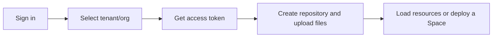

# Quick Start

## Before you start

1. **Account** — sign in, or ask an administrator to create one.
2. **Tenant / organization** — resources belong to an organization; select or create one.
3. **Access token** — used for Git operations and API calls.

## Flow

```mermaid
flowchart LR
    A["Sign in"] --> B["Select tenant/org"]
    B --> C["Get access token"]
    C --> D["Create repository and upload files"]
    D --> E["Load resources or deploy a Space"]
```

## Pages

| Page | Description |
| --- | --- |
| [Quick Start](/moha/quickstart/guide) | End-to-end walkthrough |
| [Account Settings](/moha/quickstart/account) | Account, security and credentials (IAM) |
| [Access Tokens](/moha/quickstart/token) | View and use the access token |
